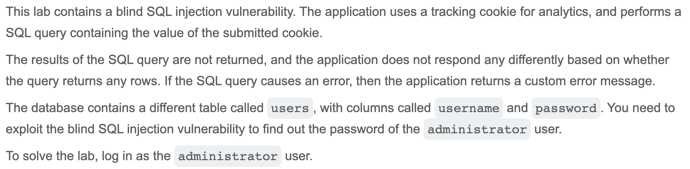

# Write-up: Blind SQL injection with conditional errors @ PortSwigger Academy

Lab-Link: <https://portswigger.net/web-security/sql-injection/blind/lab-conditional-errors>  
Difficulty: PRACTITIONER

## Exploitation
I was told that the tracking cookie value would be used for an SQL query, and also that the application would not return the query results, but would give error messages. I started by intercepting the request and testing out different payloads to get some intel on the backend.

Let's say the cookie value was `TrackingId=abc`. I tried inserting one quotation mark (`TrackingId=abc'`) and got an error. I tried with two (`TrackingId=abc''`) and it went through fine. This showed that a syntax error regarding the cookie value would display an error.

I then tried adding a simple SQL query: 

`TrackingId=abc' || (SELECT '') || '`

Despite typical syntax, this gave an error. Knowing Oracle databases require a FROM statement, I tried 
 
`TrackingId=abc' || (SELECT '' FROM dual) || '` 

and the request went through. I could then assume that the backend database was Oracle.

I tried selecting a random table name to be more certain that these inputs were being used directly in a SQL query. I input 

`TrackingId=abc' || (SELECT '' FROM random_table) || '` 

and got an error, proving the direct query input likely. To further prove this while also checking for the existence of a `users` table, I sent:

`TrackingId=abc' || (SELECT '' FROM users WHERE ROWNUM = 1) || '` 

(needed ROWNUM to prevent returning multiple rows and breaking concatenation) and it went through, validating the existence of the table.

Before honing in on the `administator` username and password, I wanted to craft a statement that would return an error if true since error messages were my main source of insight into the database. I started with the general query of 

`TrackingId=abc' || (SELECT CASE WHEN (1=1) THEN TO_CHAR(1/0) ELSE '' END FROM dual) || '` 

Because `1=1` always evaluates to True, the `CASE` statement evaluates to 1/0 which is undefined behavior, causing an error, which it did. Trying again with `1=2` caused the `ELSE` statement to trigger, leading to no error.

I used this format to check for the existence of the `administrator` user: 

`TrackingId=abc' || (SELECT CASE WHEN (1=1) THEN TO_CHAR(1/0) ELSE '' END FROM users WHERE username = 'administrator') || '` 

This returned an error, proving the username exists. If it didn't exist, no cases would be selected and thus no error triggered from `1/0`. Instead, it would evaluate to `NULL` which Oracle treats as an empty string. If the clause after the `WHEN` statement was false, the `ELSE` statement would be selected and evaluate to an empty string, causing no error. Knowing this, I could input statements regarding the password into the `WHEN` statement; if an error returns, this statement is true.

I used Burp Intruder to help automate the process. After determining that the password was 20 characters long, I repeatedly sent a version of the following payload:

`TrackingId=abc' || (SELECT CASE WHEN (SUBSTR(password, 1, 1) = 'a') THEN TO_CHAR(1/0) ELSE '' END FROM users WHERE username = 'administrator') || '`

This specific version checks if the first character of the password is `a`. I used variations of the statement to try the values a-z and 0-9 in each of the password indices, an error indicating a correct value. Eventually, I accumulated the password `a2zvji8t7yv5b8bpjj3g`. I used this to log into the `administrator` account:

