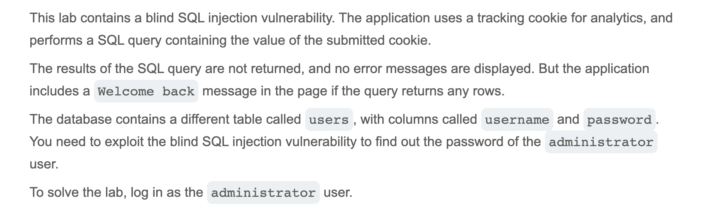
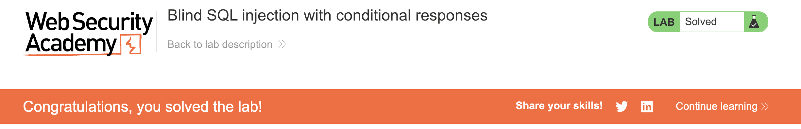

# Write-up: Blind SQL injection with conditional responses @ PortSwigger Academy


Lab-Link: <https://portswigger.net/web-security/sql-injection/blind/lab-conditional-responses>  
Difficulty: PRACTITIONER



## Exploitation
I was told that the tracking cookie value would be used for an SQL query, so I used this as my injection point. I assumed that the SQL query looked something like:

``` sql
SELECT TrackingId FROM TrackedUsers WHERE TrackingId = 'abc'
```

where `TrackingId=abc` was the cookie value. First, I tested a query that should return True, and thus should cause the page to display "Welcome back". When I added the payload `' AND '1'='1` to the end of the cookie value, the query became:

``` sql
SELECT TrackingId FROM TrackedUsers WHERE TrackingId = 'abc' AND '1'='1'
```

and the page showed:


This made sense because `'1'='1'` evaluates to True. I tried again with `'1'='2'` and the "Welcome back" message disappeared, which checked out. Next, I validated the existence of the `users` table and the `administrator` username with the following payloads:

`' AND (SELECT 'a' FROM users LIMIT 1) = 'a`

`' AND (SELECT 'a' FROM users WHERE username = 'administrator') = 'a`

If the table and username existed, `'a'` would be selected, and `'a'='a'` would evaluate to True. Expectedly, the website showed the "Welcome back" message for both payloads. Next, I needed to figure out how long the password was. I sent the following payload with varying length values until I determined that the password was 20 characters long:

`' AND (SELECT 'a' FROM users WHERE username = 'administrator' AND length(password) > 10) = 'a`

I knew this because the screen showed the "Welcome back" message for `> 19`, meaning it evaluated to True, but disappeared for `> 20`.

Finally, I worked on figuring out the password character by character. For the first character, I used the payload:

`' AND (SELECT SUBSTRING(password,1,1) FROM users WHERE username='administrator')='a`

This would evaluate to True if the first character of the password was 'a'. I had to perform this check for 20 characters, testing all possible values (letters a-z and numbers 1-9), which would prove to be tedious. Thus, I utilized Burp Intruder to automate the process. It tried all possible characters for each character index, marking which ones caused the "Welcome back" message to appear, signifying a correct character placement. It eventually led me to the password `6y8nv5cgoye3ysge1r1k`, which I used to log in to the administrator account.


