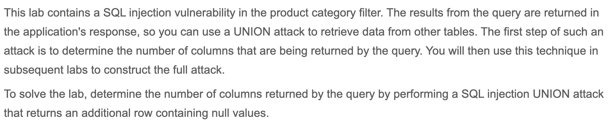
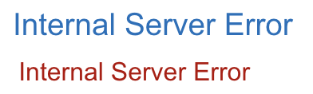
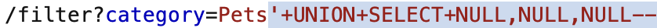
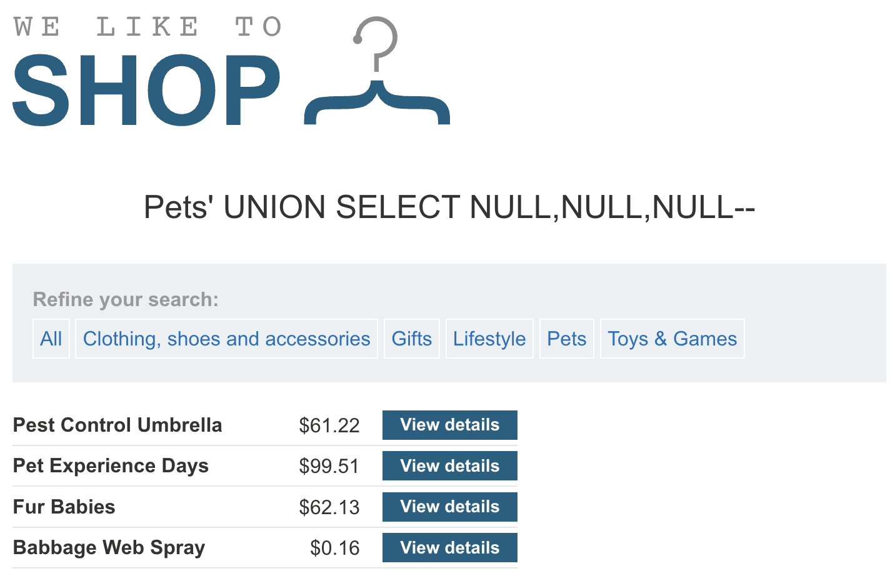
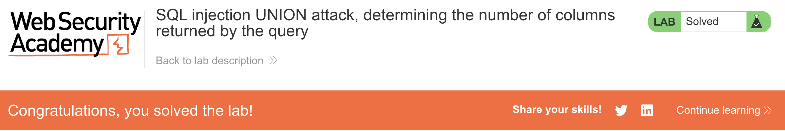

# Write-up: SQL injection UNION attack, determining the number of columns returned by the query @ PortSwigger Academy

Lab-Link: <https://portswigger.net/web-security/sql-injection/union-attacks/lab-determine-number-of-columns>  
Difficulty: PRACTITIONER

## Exploitation
In order for a UNION query to succeed, the number of columns selected from the new table has to match the number of columns selected from the initial table. This second value was unknown, so I attempted to call UNION on an increasing amount of `NULL` columns and see if the results had any giveaways. I used `NULL` because the columns being joined also had to match in data type, and `NULL` is convertible to every common data type.

I was told the vulnerability was in the product category filter, so I started by choosing a category and intercepting the request. By doing this, I could see the payload `/filter?category=Pets`. I tried injecting `' UNION SELECT NULL--`, representing 1 column, and got an internal server error:

so I knew the query did not return only 1 column. I tried again, this time selecting 2 columns (2 `NULL`s), and received the same error. I tried with 3 columns:

and the request went through:

Thus, I knew the product category query returned 3 columns.

### Second method
Another method involves trying to order the query result by incrementing column indexes, such as `' ORDER BY 1--`. The idea is that, if I got an error, I was trying to order by a column that did not exist, and so I would know that the query returned one less than that number of columns.

I started by ordering by column 1 and incremented until I got an error. I received my first internal server error message when injecting `' ORDER BY 4--`, so I knew there were 3 columns. This matched my result from using the first method.

