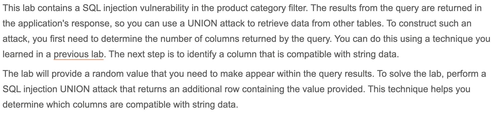
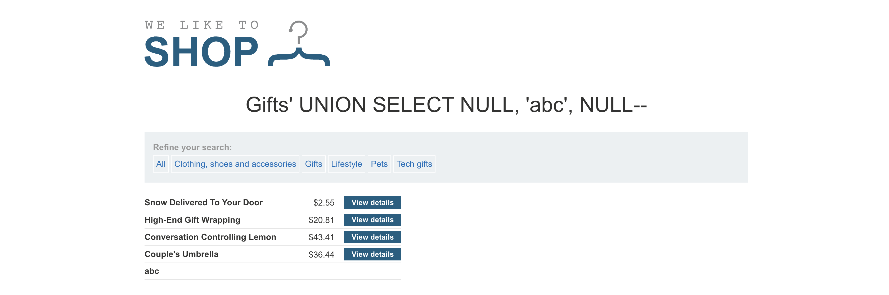
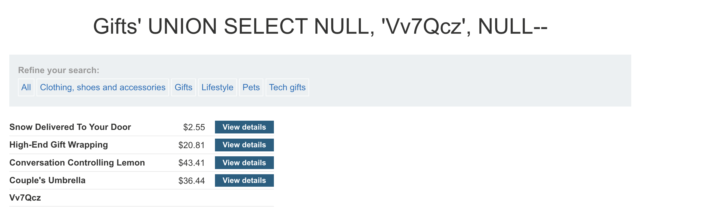
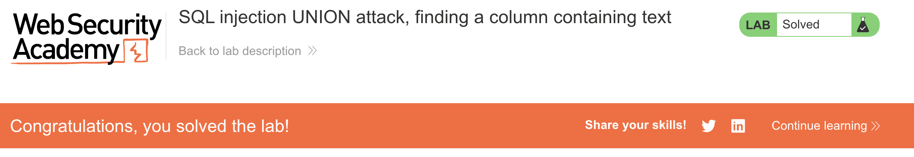

# Write-up: SQL injection UNION attack, finding a column containing text @ PortSwigger Academy

Lab-Link: <https://portswigger.net/web-security/sql-injection/union-attacks/lab-find-column-containing-text>  
Difficulty: PRACTITIONER

## Exploitation
The objective is to make the database retrieve the string `Vv7Qcz`. Ultimately, I will attempt to inject a UNION query to accomplish this, but I first need to figure out how many columns the website returns from the database. I am told the vulnerability is in the product category filter, so I choose a category and intercept the request. I am able to see the payload `/filter?category=Gifts` and, using the [UNION column count method](https://portswigger.net/web-security/sql-injection/union-attacks/lab-determine-number-of-columns), I determine the query returns 3 columns.

Next, I need to determine which columns can hold a string data type so that it can retrieve my string. I start by trying to inject the string `abc` into the first column:

and receive an internal server error. This means the first column does not return the string data type. I try again with the second column:

and the request goes through. This is validated by the `abc` shown among the product list:

Now, I can inject the string given by the lab.

