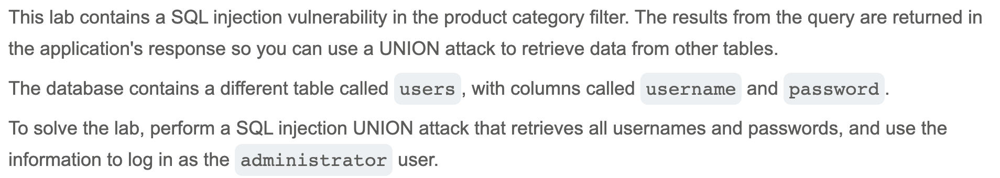
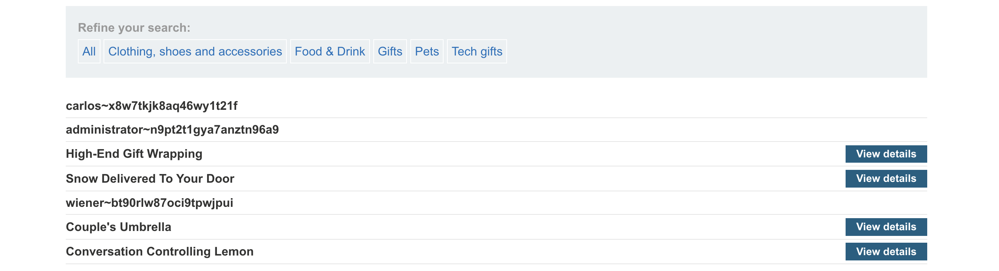
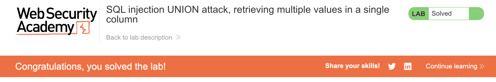

# Write-up: SQL injection UNION attack, retrieving multiple values in a single column @ PortSwigger Academy

Lab-Link: <https://portswigger.net/web-security/sql-injection/union-attacks/lab-retrieve-multiple-values-in-single-column>  
Difficulty: PRACTITIONER

## Exploitation
I started by determining how many columns the product category filter query returned and which ones could hold text, as I needed one to hold a list of concatenated usernames and passwords. Using methods from previous labs, I figured out that the query returned 2 columns, and only the second one could hold text.

Next, I drafted a payload that would allow me to attach the usernames and passwords into the second column. Note that `||` is a string concatenation operator on Oracle. I injected the following text:

and the success of this request was reflected in the updated page, now showing `<username>~<password>` among the product list:

I could then use the administrator credentials to log in.

