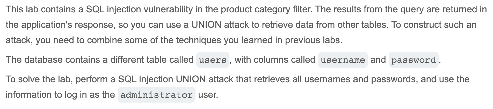
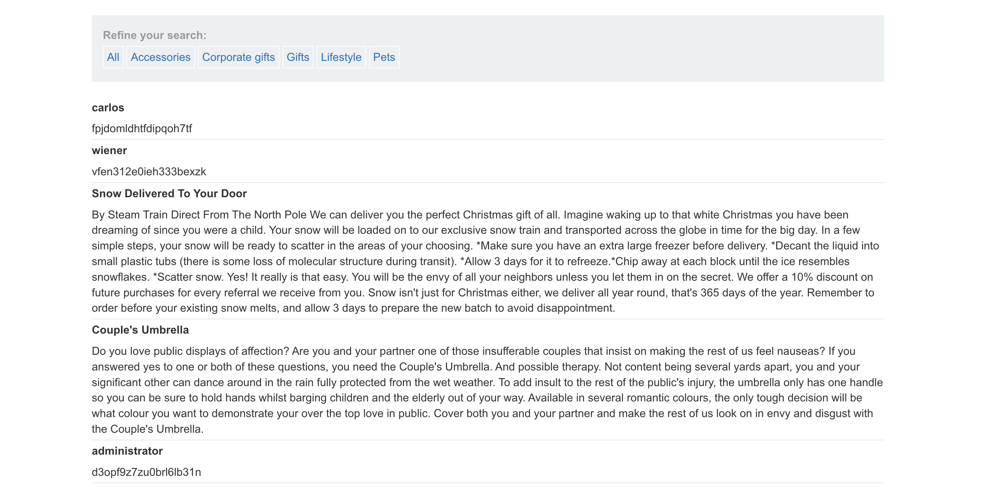
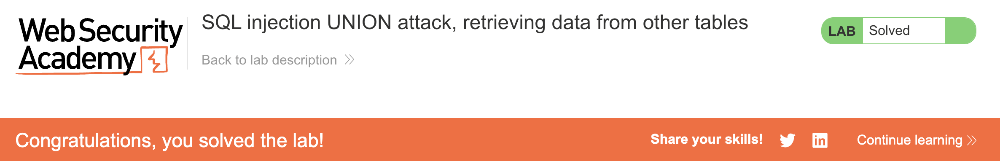

# Write-up: SQL injection UNION attack, retrieving data from other tables @ PortSwigger Academy

Lab-Link: <https://portswigger.net/web-security/sql-injection/union-attacks/lab-retrieve-data-from-other-tables>  
Difficulty: PRACTITIONER

## Exploitation
I started by determining how many columns the product category filter query returned and which ones could hold text, as they needed to hold a list of usernames and passwords. Using methods from previous labs, I figured out that the query returned 2 columns, both of which could hold text.

Next, I drafted a payload that would allow me to attach the desired data into the product retrieval results. By injecting the following text, I was able to retrieve data from the `users` table:

Note that the injected payload has to be encoded (i.e. `'+UNION+SELECT+username,+password+from+users--`) so that the URL can interpret it; Burp Suite handles this encoding automatically. The success of this injection was validated by the updated page displaying usernames and passwords among the products.

I could then log in with the administrator credentials.

