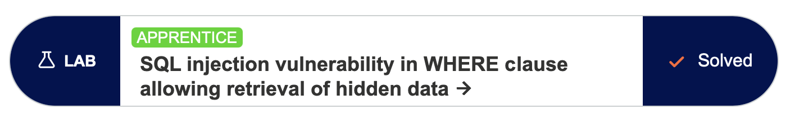
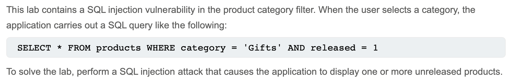
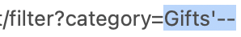
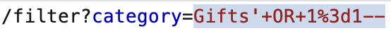
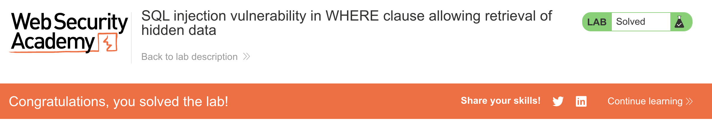

# Write-up: SQL injection vulnerability in WHERE clause allowing retrieval of hidden data @ PortSwigger Academy



Lab-Link: <https://portswigger.net/web-security/sql-injection/lab-retrieve-hidden-data>  
Difficulty: APPRENTICE



## Exploitation
I started by choosing a category (i.e. "Gifts") to see what the URL would show regarding the query. The payload showed `/filter?category=Gifts`. I knew from the lab description that this was equivalent to the query

```sql
SELECT * FROM products WHERE category = 'Gifts' AND released = 1
```

I assumed that the category parameter `Gifts` was taken directly from the URL. To show unreleased products, I needed to make `AND released = 1` be ignored. If I injected `Gifts'--`, the query became

```sql
SELECT * FROM products WHERE category = 'Gifts'--' AND released = 1
```

I used the quotation mark to close the parameter string, and `--` to comment out the rest of the query. Now, the query did not only select products that had the released flag. Injecting



into the URL caused the screen to go from showing 3 products to 4, proving that the released part of the query was ignored.

In order to display all products, including unreleased, regardless of category, I needed to construct a query that evaluated to `TRUE` for every table entry. If I injected `Gifts' OR 1=1--`, the query became

```sql
SELECT * FROM products WHERE category = 'Gifts' OR 1=1--' AND released = 1
```

`1=1` always evaluates to `TRUE`, and everything after was commented out and ignored. When injecting via Burp Suite, the payload in the URL needed to be encoded via `Cmd+U`.



The page changed to show all products and displayed

