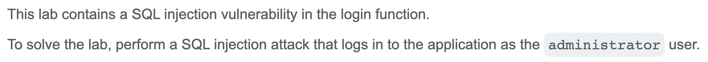
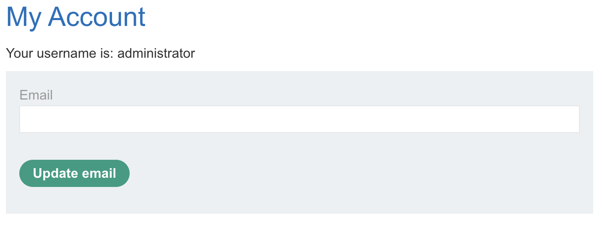
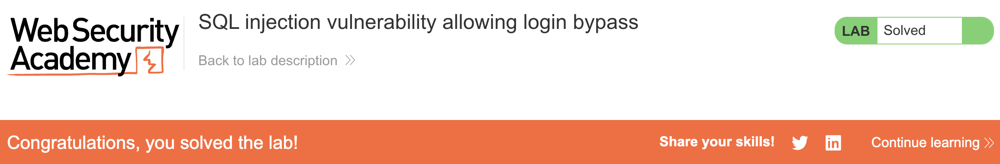

# Write-up: SQL injection vulnerability allowing login bypass @ PortSwigger Academy


Lab-Link: <https://portswigger.net/web-security/sql-injection/lab-login-bypass>  
Difficulty: APPRENTICE



## Exploitation
I am assuming that the query to log in looks something like 

```sql
SELECT * FROM users WHERE username = '<USER>' AND password = '<PASS>'
```

When I attempt to log in as user `hello` and password `bye` and intercept the request via Burp Suite, I can see the POST data:


I want to bypass the need for a password by commenting it out of the query. Just like URL parameters, the username field is vulnerable to injection. Thus, I am going to log in with the username `administrator'--` in the website's login field. The password doesn't matter since it will not be used. This allows me to successfully log in as the administrator:



